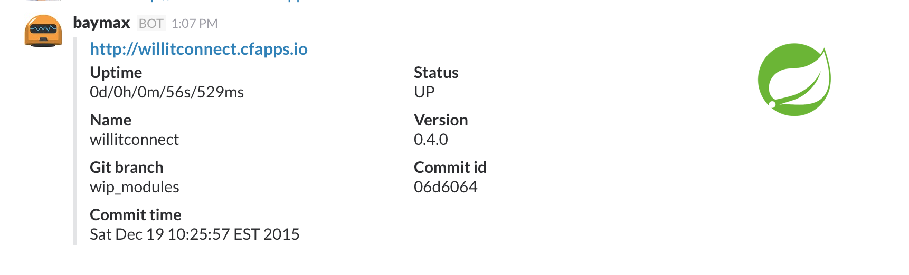

# hubot-boot-me

A hubot script that returns information about spring boot apps in slack

See [`src/boot-me.coffee`](src/boot-me.coffee) for full documentation.

## Installation

In hubot project repo, run:

`npm install hubot-boot-me --save`

Then add **hubot-boot-me** to your `external-scripts.json`:

```json
[
  "hubot-boot-me"
]
```

## Sample Interaction

```
hubot bootme http://willitconnect.cfapps.io
```


